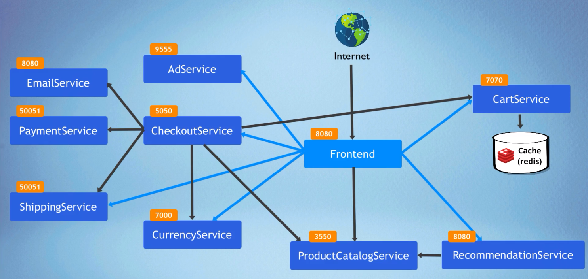

# Microservices E-Commerce Application Deployment on Kubernetes

This project demonstrates the deployment of a cloud-native, microservices-based e-commerce application (**Online Bouquet Shop**) onto a Minikube Kubernetes cluster. It showcases best practices for deploying, managing, and scaling distributed systems using Kubernetes manifests.

## Demo

Watch a short video demonstrating the deployed application running live in a browser, accessed via Kubernetes NodePort:

[Click to Watch Demo Video](https://youtu.be/qqYtg7rOb7E)

Here is a Screenshot of working project running on a Browser:
[Reference Image](screenshots/running-on-browser.png)
---

## Table of Contents

- [Overview](#overview)
- [Key Features & Highlights](#key-features--highlights)
- [Architecture](#architecture)
- [Microservices](#microservices)
- [Technologies Used](#technologies-used)
- [Deployment Instructions](#deployment-instructions)
  - [Prerequisites](#prerequisites)
  - [Clone Repository](#clone-repository)
  - [Deploy Microservices (using kubectl)](#deploy-microservices-using-kubectl)
  - [Verify Deployment](#verify-deployment)
  - [Access Application](#access-application)
- [Helm Deployment Option](#helm-deployment-option)
- [Acknowledgements](#acknowledgements)

---

## Overview

This project provides an example of an e-commerce platform built with a microservice architecture. Each core functionality (product catalog, cart management, checkout, payments, etc.) is handled by a separate, independently deployable service.

The primary goal is to demonstrate proficiency in deploying and managing such applications using Kubernetes, leveraging its features for orchestration, service discovery, scaling, and resilience. Users can browse items, add them to the cart, and simulate a checkout process.

---

## Key Features & Highlights

- **Microservice Architecture:** Decomposed the application into multiple fine-grained, independent services communicating over the network (primarily gRPC).
- **Kubernetes Deployment:** Utilized standard Kubernetes objects (Deployments, Services) defined in YAML manifests for declarative infrastructure and application management.
- **Scalability & High Availability:** Configured multiple replicas (`replicas: 2`) for most services to ensure availability and handle load.
- **Containerization:** Leveraged pre-built Docker container images (from `gcr.io/google-samples/microservices-demo`) for consistent runtime environments.
- **Service Discovery:** Services communicate reliably using Kubernetes internal DNS names (e.g., `productcatalogservice:3550`, `redis-cart:6379`).
- **Health Checks:** Implemented Readiness and Liveness probes (gRPC/TCP) for key services, enabling Kubernetes to automatically manage container health and traffic routing.
- **Resource Management:** Defined CPU and Memory requests and limits for containers, promoting efficient resource utilization within the cluster.
- **External Access:** Exposed the `frontend` service using Kubernetes `NodePort` for easy access during development and testing.
- **Stateful Component:** Integrated Redis (`redis-cart`) as a caching/storage layer for the shopping cart service, deployed within Kubernetes.

---

## Architecture

The application follows a distributed microservice architecture where each service focuses on a specific business capability. Services are containerized and run within a Kubernetes cluster. Communication between services primarily uses gRPC (as per the original Google demo design), facilitated by Kubernetes Services for stable endpoints and load balancing. Redis is used by the Cart Service for persistence.



---

## Microservices

The application comprises the following microservices:

- **`frontend`**: Serves the web UI, interacts with downstream services. (Exposed via NodePort)
- **`productcatalogservice`**: Manages the list of products.
- **`cartservice`**: Manages users' shopping carts (uses Redis).
- **`currencyservice`**: Provides currency conversion.
- **`recommendationservice`**: Suggests products to users.
- **`shippingservice`**: Calculates shipping costs.
- **`paymentservice`**: Handles payment processing simulation.
- **`emailservice`**: Simulates sending emails (e.g., order confirmation).
- **`adservice`**: Provides contextual advertisements.
- **`checkoutservice`**: Orchestrates the checkout process, coordinating other services.
- **`redis-cart`**: Redis instance used by `cartservice`.

---

## Technologies Used

- **Orchestration:** Kubernetes (minikube)
- **Container Runtime:** Docker (implicitly, via images)
- **Configuration:** Kubernetes YAML
- **Version Control:** Git / GitHub
- **(Optional) Packaging:** Helm

---

## Deployment Instructions

Follow these steps to deploy the application onto your Kubernetes cluster.

### Prerequisites

- `kubectl` command-line tool installed and configured to connect to your cluster.
- Access to a running Kubernetes cluster (e.g., Minikube).
- Git installed.

### Clone Repository

```bash
git clone https://github.com/TheSudheer/Online-Bouquet.git
cd Online-Bouquet
```

### Deploy Microservices (using kubectl)

Apply the Kubernetes manifests for each microservice directly using `kubectl`. The `---` separator within files allows deploying multiple resources (Deployment and Service) from a single file.

```bash
kubectl apply -f adservice.yaml
kubectl apply -f cartservice.yaml
kubectl apply -f checkoutservice.yaml
kubectl apply -f currencyservice.yaml
kubectl apply -f emailservice.yaml
kubectl apply -f frontend.yaml
kubectl apply -f paymentservice.yaml
kubectl apply -f productcatalogservice.yaml
kubectl apply -f recommendationservice.yaml
kubectl apply -f rediscartservice.yml # Note .yml extension
kubectl apply -f shippingservice.yaml
```

Alternatively, apply all manifests in the directory at once (ensure no unrelated YAML files are present):

```bash
kubectl apply -f .
```

### Verify Deployment

Check if all pods are running successfully. It might take a minute or two for all containers to download and start:

```bash
kubectl get pods
```

You should see pods for each deployed service in the `Running` state. Use the following command to inspect logs if any pod is crashing:

```bash
kubectl logs <pod-name>
```

### Access Application

The `frontend` service is exposed via a `NodePort`. Find the port assigned by Kubernetes:

```bash
kubectl get service frontend
```

Look under the `PORT(S)` column. It will show something like `80:30007/TCP`. The number after the colon is the NodePort.

To access the application:

- **Minikube:** Run `minikube ip` or `minikube service frontend --url`
- **Kind:** Use port forwarding or find node IP as per your setup
- **Docker Desktop:** Use `localhost` or `127.0.0.1`
- **Cloud (EKS, GKE, AKS):** Use the external IP of a worker node

Then, navigate to `http://<NODE_IP>:<NODE_PORT>` in your web browser (e.g., `http://192.168.49.2:30007`).

---

## Helm Deployment Option

📌 **Note:** This project also includes Helm charts for a more managed deployment approach. Helm helps template Kubernetes manifests, manage releases, and simplify complex deployments.

To deploy using Helm, navigate to the `charts/` directory in this repository.

> Follow the instructions in the `charts/README.md` for Helm-based deployment.

---

## Acknowledgements

This project utilizes the microservices architecture and container images originally developed by Google for their [microservices-demo](https://github.com/GoogleCloudPlatform/microservices-demo).

